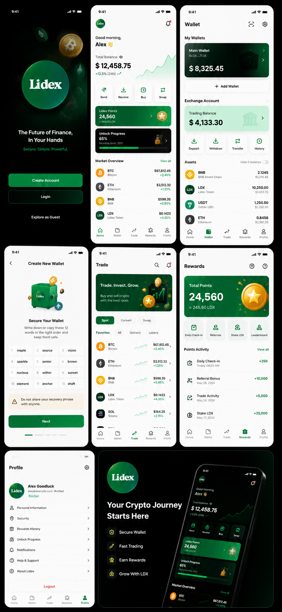

# Lidex

A mobile-first crypto super-app monorepo built from the supplied Lidex concept. It includes a high-fidelity Flutter client and a typed NestJS API foundation for a hybrid non-custodial wallet + exchange account.



## What is implemented

### Flutter mobile app

- Animated splash, premium dark welcome, registration, login, and guest flow
- Five icon-only tabs with accessibility labels: Home, Wallet, Trade, Rewards, Profile
- Home portfolio, quick actions, reward/unlock cards, market overview, referral entry
- Hybrid wallet interface: personal wallet, exchange balance, asset list, deposit/withdraw/transfer/history actions
- Local BIP-39 wallet generation and import with Ethereum derivation path `m/44'/60'/0'/0/0`
- AES-256-GCM encryption before Hive persistence; master key isolated in Android Keystore/iOS Keychain via Secure Storage
- Biometric-gated private-key access
- Receive QR, 12-word backup flow, custom token entry point
- LDX BEP-20 client for live `balanceOf` and locally signed `transfer` calls on BNB Smart Chain (chain ID 56)
- Spot/convert/swap experience, search, market list, buy/sell sheets
- Rewards, daily check-in, points history, 20% monthly unlock visualization
- Referral code/link/QR and statistics
- LDX staking dashboard and claim entry points
- Profile, sessions/security UI, dark mode, notifications/settings entry points
- Riverpod, Freezed-generated session state, Flutter Hooks animation, GoRouter shell, Dio, Hive, Flutter Secure Storage
- Firebase Analytics, Crashlytics, and FCM startup hooks that activate after native Firebase files are supplied
- Responsive width constraints, semantics, haptics, skeleton component, fade/slide transitions, dark theme

### NestJS API

- Versioned `/api/v1` API with strict DTO validation and Swagger in non-production at `/docs`
- Argon2id password hashing
- 15-minute JWT access tokens and rotating 30-day refresh tokens
- Hashed refresh-token storage, device sessions, revocation, auth rate limits
- PostgreSQL/Prisma schema and initial migration
- Redis cache abstraction
- Users, wallets, blockchain, trading, rewards, referrals, staking, notifications, settings, and health modules
- Idempotency keys for financial orders and reward check-ins
- LDX balance and BSC transaction-status endpoints through ethers v6
- Helmet, CORS allowlist, compression, global request validation
- Docker multi-stage non-root API image and local PostgreSQL/Redis Compose stack 

## Repository

```text
lidex-network/
├── apps/
│   ├── mobile/                  # Flutter 3 / Dart 3 app
│   │   ├── android/             # Native Android scaffold
│   │   ├── ios/                 # Native iOS scaffold
│   │   ├── lib/
│   │   │   ├── config/
│   │   │   ├── core/            # Router, vault, blockchain, networking
│   │   │   ├── models/
│   │   │   ├── shared/widgets/
│   │   │   └── features/        # Auth, home, wallet, trade, rewards…
│   │   └── test/
│   └── api/                     # NestJS + Prisma API
│       ├── prisma/
│       ├── src/
│       └── Dockerfile
├── docs/
├── docker-compose.yml
└── Makefile
```

## Run the mobile app

Requirements: Flutter stable and an Android Studio/Xcode toolchain.

```bash
cd apps/mobile
flutter pub get
dart run build_runner build --delete-conflicting-outputs
flutter run \
  --dart-define=API_BASE_URL=http://http://127.0.0.1/:3000/api/v1 \
  --dart-define=BSC_RPC_URL=https://bsc-dataseed.binance.org/
```

For a physical device, replace `10.0.2.2` with the development machine's LAN IP or a deployed HTTPS API.


### Firebase

Run `flutterfire configure` from `apps/mobile`, add the generated native configuration files, enable Analytics/Crashlytics/Messaging in the Firebase console, and add APNs credentials for iOS. The app intentionally stays runnable as a design/demo build when Firebase is not configured.

### Native signing

- Android: create an upload keystore and release signing config; never commit `key.properties` or `.jks` files.
- iOS: select the production team, bundle ID, push entitlement, and distribution profile in Xcode.

## Run the API

Requirements: Node.js 20+, npm, Docker.

```bash
cp apps/api/.env.example apps/api/.env
# Replace both JWT secrets before starting.
docker compose up -d postgres redis
cd apps/api
npm ci
npx prisma migrate deploy
npm run start:dev
```

Check `http://localhost:3000/api/v1/health` and open `http://localhost:3000/docs` in development.

To run the complete API container after creating `apps/api/.env`:

```bash
docker compose up --build
```

## LDX network configuration

| Item | Value |
|---|---|
| Network | BNB Smart Chain Mainnet |
| Chain ID | `56` |
| Token | Lidex Token |
| Symbol | `LDX` |
| Contract | `0x567A4F63f6838005e104C053fc24a3510b0432E1` |
| Interface | Standard BEP-20/ERC-20 `balanceOf`, `transfer`, `decimals`, `symbol` |

The contract address is centralized in `apps/mobile/lib/config/app_config.dart` and `apps/api/.env`. Verify the deployed bytecode, decimals, ownership, liquidity, and explorer verification independently before enabling real-value transfers.

## Validation completed

This handoff was checked with:

```text
Flutter 3.44.6 / Dart 3.12.2
flutter analyze              → no issues
flutter test                 → all tests passed
Prisma client generation     → passed
NestJS TypeScript build      → passed
```

An Android APK could not be assembled in the build environment because it does not provide an Android SDK. Native Android and iOS scaffolds are included; CI runs Flutter analysis/tests.

## Production boundary

The repository is a production-oriented foundation, not a license, custody, banking, or exchange deployment. Screens currently use intentional demo portfolio/market values while API contracts and secure wallet primitives are wired for integration. Before handling real funds, complete the release checklist in [`docs/RELEASE_CHECKLIST.md`](docs/RELEASE_CHECKLIST.md), including:

- independent mobile, backend, smart-contract, and cryptography audits;
- KYC/AML, sanctions, transaction monitoring, market/data and custody vendors;
- exchange ledger with double-entry accounting and reconciliation;
- HSM/MPC/KMS-controlled exchange signing and withdrawal policy engine;
- BSC indexer with reorg handling and confirmation thresholds;
- testnet soak tests, incident response, observability, backups, DR, and legal review.

**The backend never receives or stores personal-wallet seed phrases or private keys.** Exchange custody must be implemented through an audited HSM/MPC provider, not application environment variables.
