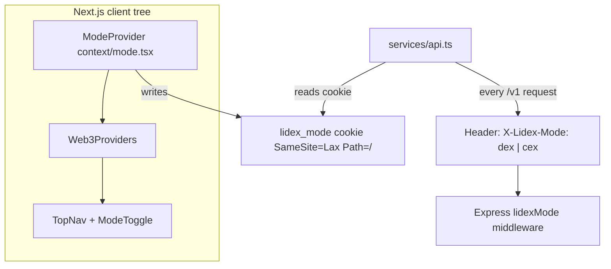
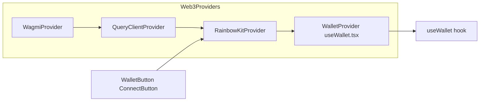
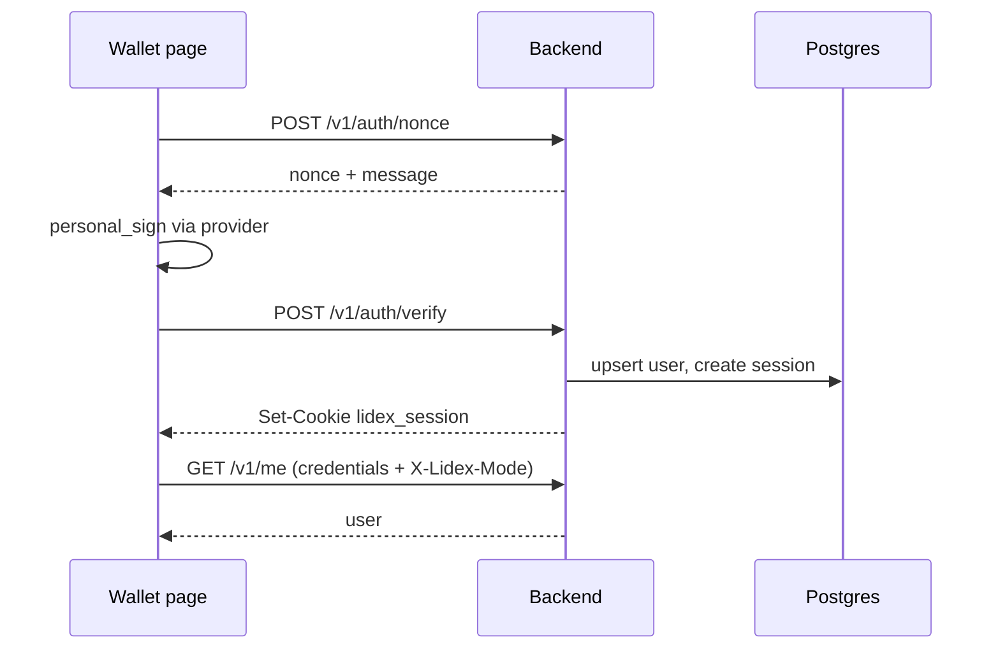

# Lidex — system architecture

End-to-end map of **framework, UI, wallet, and how pieces talk**. Use this with [`phase-1-tracking.md`](./phase-1-tracking.md) before expanding into Phase 2.

**Related docs:** [`vision.md`](./vision.md) · [`phase-1-plan.md`](./phase-1-plan.md) · [`phase-2-plan.md`](./phase-2-plan.md) · [`phase-2-tracking.md`](./phase-2-tracking.md) · [`phase-3-plan.md`](./phase-3-plan.md) · [`phase-3-tracking.md`](./phase-3-tracking.md) · [`phase-4-plan.md`](./phase-4-plan.md) · [`phase-4-tracking.md`](./phase-4-tracking.md) · [`phase-8-plan.md`](./phase-8-plan.md) · [`phase-8-tracking.md`](./phase-8-tracking.md) · [`cex-compliance-and-ops.md`](./cex-compliance-and-ops.md) · [`dex-env.md`](./dex-env.md) · [`ui-framework.md`](./ui-framework.md) · [`backend-modules.md`](./backend-modules.md) (scaffold conventions; actual routes live in `server.js`).

---

## 1. Repository layout

| Package | Path | Role |
|--------|------|------|
| Frontend | `frontend/` | Next.js App Router, React 19, RainbowKit + wagmi |
| Backend | `backend/` | Express 5, Prisma → PostgreSQL |
| Shared | `shared/` | Node `index.js`: constants, chains, tokens, pairs (backend and tooling; frontend often duplicates token helpers locally) |
| Contracts | `contracts/` | Solidity / Hardhat (not on the hot API path for Phase 1) |

Monorepo: npm workspaces from repo root (`lidex/package.json`).

---

## 2. Frontend shell and hybrid mode (DEX vs CEX)

The UI supports **two product modes**. The browser must tell the API which mode is active so the backend can allow or deny DEX-only vs CEX-only endpoints.

| Mechanism | Location | Contract |
|-----------|----------|----------|
| React state + cookie | `frontend/context/mode.tsx` | Cookie name `lidex_mode`; values `dex` \| `cex`. |
| API header | `frontend/services/api.ts` | `LIDEX_MODE_HEADER` (`X-Lidex-Mode`) must stay aligned with `backend/middleware/lidexMode.js`. |
| CORS | `backend/middleware/security.js` | Allows header `X-Lidex-Mode`; `credentials: true`. |

**Navigation:** `TopNav` uses `useMode()` to show CEX-only links (e.g. Trade, Staking, Launchpad) only when `mode === "cex"`.

---

## 3. Liquidity model — DEX vs CEX (hard split)

This is a **product and engineering invariant**: do not mix external aggregation on CEX execution paths, or internal books on DEX swap paths.

| Surface | Liquidity | Role of 0x |
|---------|-----------|------------|
| **DEX (non-custodial)** | **External only** — AMMs / RFQ sources that **0x** can aggregate | **0x is the external liquidity provider for DEX only.** Wallet swap (`/v1/swap/*`) goes through the **0x API**; Lidex does not supply an internal order book or internal pool for that flow. |
| **CEX (custodial / internal)** | **Internal only** — order book, custodial inventory, matching as you build in Phase 3+ | **0x is not used** for CEX trade execution. No routing customer CEX orders through 0x. |

**Why:** Clear boundaries reduce bugs, simplify compliance narratives (wallet vs custodial), and avoid double-counting or ambiguous fill sources.

**AMM liquidity first, then 0x quotes:** Lidex **does not** deploy or seed Pancake/other AMM pools for you. **0x** aggregates liquidity that **already exists** on supported venues (e.g. **PancakeSwap** on BSC). Until **you** add LP for pairs like LDX/USDT on those DEXs, **`/v1/swap/quote`** for LDX routes will not succeed — there is nothing for 0x to route through. After pools go live, quotes and trades via the app typically **start working automatically** (subject to 0x supporting those pools on that chain).

**Listing “active” in the app without a code deploy:** backend **`.env`** can set **`DEX_ACTIVE_PAIR_SYMBOLS`** (and optional **`DEX_POOL_*`**) so markets APIs move LDX rows out of “Coming Soon” — see [`dex-env.md`](./dex-env.md). That does not replace the need for real AMM liquidity for quotes.

**API alignment today:** `requireDexMode` protects **`/v1/swap/quote`** and **`/v1/swap/execute`** (0x-backed). CEX-gated routes (`requireCexMode`) cover internal-style surfaces (e.g. fees summaries, candles, `/v1/pairs` listing context). When you add a **CEX matcher**, keep it **off** the swap module that calls 0x.

---

## 4. Wallet stack (RainbowKit + wagmi)

| File | Responsibility |
|------|------------------|
| `frontend/wallet/wagmiConfig.ts` | `getDefaultConfig`: chains (BSC, mainnet, polygon, arbitrum, avalanche), WalletConnect project id from env or demo fallback. |
| `frontend/components/Web3Providers.tsx` | Mounts wagmi, React Query, RainbowKit, `WalletProvider`. |
| `frontend/components/WalletButton.tsx` | RainbowKit `ConnectButton` only (no SIWE in the button). |
| `frontend/wallet/useWallet.tsx` | Wraps wagmi `useAccount` / `useDisconnect` / `useSwitchChain`; resolves EIP-1193 `provider` from `connector.getProvider()`; holds `user` from `/v1/me`. |

**Important:** Use **`useWallet()`** only for EVM connection state (single wallet model).

---

## 5. Wallet connected vs API session (two layers)

| Layer | Meaning | How |
|-------|---------|-----|
| **Wagmi connected** | User chose a wallet in RainbowKit; address/chain available in the client. | `useWallet().address`, `chainId`, `provider`. |
| **Backend session** | Server knows “this browser is user X” for personalized referral, ledger, etc. | HttpOnly cookie `lidex_session` after **`POST /v1/auth/verify`**. |

**Login flow today** (implemented on **`/wallet`**, DEX branch): `getNonce` → `personal_sign` → `verify` → `refreshMe()`. RainbowKit **connect alone does not** create a backend session.

**Session sync:** `disconnect()` clears the API session; switching wallet account while logged in invalidates the cookie if the address no longer matches. Re-sign on **Wallet** after changing accounts. Details: [`phase-1-tracking.md`](./phase-1-tracking.md).

After verify, `frontend/wallet/auth.ts` may call **`POST /v1/referral/attach`** if a ref code is stored (cookie/param), then clear the ref.

---

## 6. HTTP client and CORS

| Concern | Frontend | Backend |
|---------|----------|---------|
| Base URL | `NEXT_PUBLIC_BACKEND_URL` (default `http://localhost:4000`) | `PORT` (default `4000`) |
| Cookies | `credentials: "include"` on `apiGet` / `apiPost` in `services/api.ts` | `sessionMiddleware` + `cookie-parser`; session cookie httpOnly. |
| Swap page | Also uses **raw `fetch`** with the same base URL, `credentials: "include"`, and `lidexModeHeaders()` | Same CORS rules. |

**Recommendation for Phase 2:** route swap (and new features) through **`services/api.ts`** helpers so `X-Lidex-Mode` and credentials never drift.

**CORS allowlist:** `ALLOWED_ORIGINS` (comma-separated); defaults include `http://localhost:3001` and `http://127.0.0.1:3001`.

---

## 7. Backend request pipeline

Typical order in `backend/server.js`:

1. `securityHeaders`
2. `cors` (with credentials + `X-Lidex-Mode`)
3. `express.json`
4. **`sessionMiddleware`** → `req.user` when valid session + DB user
5. For **`/v1`**: **`lidexModeMiddleware`** → `req.lidexMode` from header or `lidex_mode` cookie
6. Route-specific: **`requireLidexMode`**, **`requireDexMode`**, **`requireCexMode`**, rate limiters

**Persistence:** Prisma client in `backend/lib/prisma.js`; models in `backend/prisma/schema.prisma` (users, referral attachments, ledger, auth sessions).

---

## 8. API matrix (`/v1`)

All `/v1/*` routes participate in **lidex mode resolution** via middleware. The table shows **additional** gates.

| Method | Path | `requireLidexMode` | Mode gate | Notes |
|--------|------|-------------------|-----------|--------|
| GET | `/health` | — | — | No `/v1` prefix. |
| POST | `/v1/auth/nonce` | No | — | Rate limited (auth). |
| POST | `/v1/auth/verify` | No | — | Sets session cookie. |
| POST | `/v1/auth/logout` | No | — | Clears session. |
| GET | `/v1/me` | Yes | — | Session optional; returns `user`. |
| GET | `/v1/referral/link` | Yes | — | Referral limiter. |
| GET | `/v1/referral/stats` | Yes | — | |
| GET | `/v1/referral/users` | Yes | — | Expects auth for 401 semantics in app. |
| POST | `/v1/referral/attach` | Yes | — | |
| POST | `/v1/referral/ledger/confirm` | Yes | **DEX only** | |
| POST | `/v1/referral/ledger/mark-paid` | Yes | — | |
| GET | `/v1/fees/summary` | Yes | **CEX only** | |
| GET | `/v1/fees/events` | Yes | **CEX only** | |
| GET | `/v1/markets/pairs` | Yes | — | |
| GET | `/v1/markets/stats` | Yes | — | |
| GET | `/v1/markets/candles` | Yes | **CEX only** | |
| GET | `/v1/pairs` | Yes | **CEX only** | |
| POST | `/v1/swap/quote` | Yes | **DEX only** | **External liquidity via 0x only** (see §3). |
| POST | `/v1/swap/execute` | Yes | **DEX only** | Same. |

If the UI is in **DEX** mode but calls a **CEX-only** route (or the reverse), the API responds **403**. New screens should be checked against this matrix. **Do not** add 0x-backed execution behind `requireCexMode`.

---

## 9. Frontend pages → backend (typical)

| Area | Page / feature | Calls (examples) |
|------|----------------|------------------|
| Home | `app/page.tsx` | `/v1/markets/pairs`, `/v1/markets/stats` |
| Markets | `app/markets/page.tsx` | pairs, stats, candles (CEX mode for candles) |
| Trade | `app/trade/...` | stats, candles via `apiGet` |
| Swap | `app/swap/page.tsx` | `/v1/swap/quote`, `/v1/swap/execute`, optional ledger confirm |
| Referral | `app/referral/page.tsx` | `/v1/referral/link`, `/v1/referral/stats` |
| Wallet | `app/wallet/page.tsx` | `/v1/auth/*`, `/v1/me` via `wallet/auth.ts` + `useWallet` |

---

## 10. Environment variables (quick reference)

**Frontend (`frontend/.env.local`):** `NEXT_PUBLIC_BACKEND_URL`, `NEXT_PUBLIC_WALLETCONNECT_PROJECT_ID`.

**Backend (`backend/.env`):** `DATABASE_URL`, `ALLOWED_ORIGINS`, `OX_API_KEY`, swap fee vars, optional `COOKIE_SECURE` / `COOKIE_DOMAIN`, `APP_PUBLIC_URL`, rate limit overrides. See `backend/.env.example`.

---

## 11. Evolution (Phase 2+)

- **Phase 3 — CEX:** custodial ledger, orderbook, **internal matcher** — see [`phase-3-plan.md`](./phase-3-plan.md). **No 0x** on CEX execution paths ([§3](#3-liquidity-model--dex-vs-cex-hard-split)).
- Prefer **one API client layer** for all authenticated and mode-aware calls.
- Consider **shared types** or OpenAPI for request/response contracts between frontend and backend.
- Optionally split `server.js` into module routers per [`backend-modules.md`](./backend-modules.md) as the API grows.

Phase 1 session/wallet notes: [`phase-1-tracking.md`](./phase-1-tracking.md).
